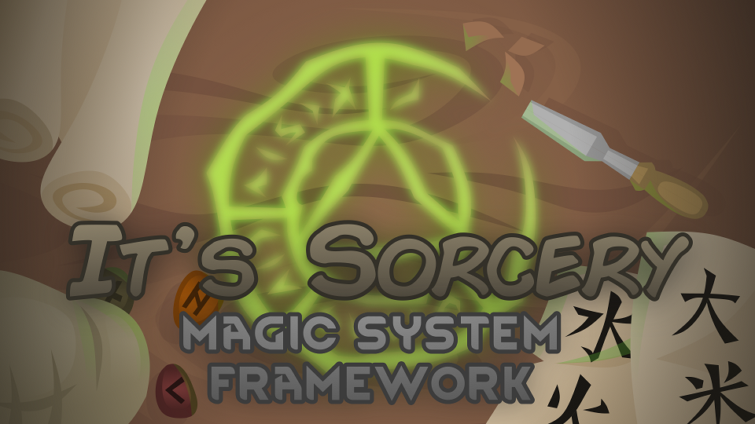

## Introduction
**It's Sorcery!** is a framework designed to build modular magic systems in XML. You may be asking "Why would I want to use this mod?"

1) If you want to have magic abilities in RimWorld, but want them to specifically fit the lore you've developed (such as using mana versus building up neural heat), you can make a magic system as such.
2) If you want your magic abilities to rely on multiple energy types (say, electricity and fuel for a flamethrower ability), you can create a system that can store all that information.
3) If you want a convienent way for pawns to level up and gain abilities or passives, all with specific requirements, you can build a progression and learning system in mod.

## FAQ

- **Is there any resource I can use when developing this mod?** This mod has a wiki- go and check it out for a fairly in-depth look. The source code is also included in the repo if you want to build custom components based on it.
- **I'm the type of person who learns by doing. Are there any examples on how to use this mod?** There is a link for an example mod that you can use in the wiki. It doesn't touch on all the features the framework offers, but it should provide you with enough guidance and confidence.
- **Does this framework include [insert functionality not in the framework here]?** No, but I bet it's possible. If it's a really nice bit of functionality that can be used more generally, feel free to contribute it to this mod. I'm only one man, after all.

## Credits
Warmest thanks go to:

- **Gouda quiche**, my C# mentor;
- **Fraudecon**, for his input and wisdom;
- **Flango**, for his contribution of skill trees to the learning system;
- **Feldoh**, for his suggestions in developing the framework;
- **DetVisor**, for his art contributions;

And many others within the RimWorld community.

## DISCLAIMER
This framework is not intended to be a replacement for the Royalty DLC, and should not be considered as such. It does emulates various features of Royalty, however.

As such, if requested by Ludeon, this mod will require the Royalty DLC.
